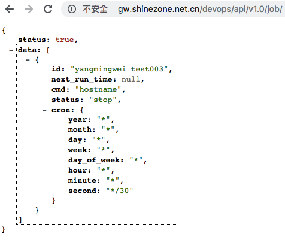

# SapiGW项目介绍
SapiGW网关系统,是基于openresty + Lua开发的一套API网关系统,主要功能如下：

- API鉴权

- API 限速

- 白名单

- 日志记录

# 一、openresty部署
```bash
# yum部署(推荐)
yum install yum-utils
yum-config-manager --add-repo https://openresty.org/package/centos/openresty.repo
yum install openresty
yum install openresty-resty
```

```bash
# 源码部署
wget https://openresty.org/download/openresty-1.13.6.2.tar.gz
tar zxf openresty-1.13.6.2.tar.gz && cd openresty-1.13.6.2
./configure --prefix=/usr/local/openresty-1.13.6.2 \
--with-luajit --with-http_stub_status_module \
--with-pcre --with-pcre-jit
gmake && gmake install
ln -s /usr/local/openresty-1.13.6.2/ /usr/local/openresty
ln -s /usr/local/openresty/bin/resty /usr/bin/resty
```

# 二、项目部署及配置

```bash
git clone https://github.com/yangmv/SapiGW.git
\cp -arp SapiGW/* /usr/local/openresty/nginx
# vim conf/nginx.conf
# 修改 resolver 10.0.0.1;     配置DNS服务器
# 修改 lua_code_cache on;     线上环境设置为on
/usr/local/openresty/nginx/sbin/nginx   #启动服务
```

# 三、使用配置,注册API
要接入API网关系统，则要先进行注册，注册方式如下：

​	a、配置文件config.lua中的rewrte_conf

​	b、POST注册接口(暂无)

注册示例如下：

```lua
rewrite_conf = {
	['gw.xxx.net.cn'] = {
        rewrite_urls = {
			{
				uri = "/devops",
				rewrite_upstream = "devops.xxx.net.cn"
			},
            {
				uri = "/cmdb",
				rewrite_upstream = "aaaa.xxx.net.cn:8888"
			},
        }
    }
}
```

如上可以看到，注册了2个服务【devops】和【cmdb】


# 四、API鉴权权限

在configs.lua文件中配置redis信息和刷新redis权限接口信息，此信息由权限系统【SuperMG】提供

权限验证步骤如下：
- 获取cook信息，得到auth_key
- 根据私钥及加密算法解密auth_key
- 得到用户ID
- 获取当前uri及method
- redis中查询用户id的权限列表进行匹配
- 匹配不通过则rewrite login

在这里来测试 devops服务的job接口

​	原接口地址：http://devops.xxx.net.cn/api/v1.0/job/

​	现接口地址：http://gw.xxx.net.cn/devops/api/v1.0/job/

测试：

​        首次访问 http://gw.xxx.net.cn/devops/api/v1.0/job/ 跳转到login页面登录

​        登录成功,再次访问进行uri鉴权,鉴权成功则如下




# 四、API限速

在configs.lua文件中配置limit,配置示例如下

```lua
limit_conf = {
    rate = 10,   --限制ip每分钟只能调用n*60次接口
    burst = 5, 	 --桶容量,用于平滑处理,最大接收请求次数
}
```

次配置为每秒10个并发请求，并临时允许超出5个请求并平滑处理掉：

测试：

```shell
ab -c 100 -n 1000 http://gw.xxx.net.cn/devops/api/v1.0/job/
```

```shell
Document Path:          /devops/api/v1.0/job/
Document Length:        245 bytes

Concurrency Level:      100
Time taken for tests:   2.810 seconds
Complete requests:      1000
Failed requests:        985
```

可以看到,差不多有15个请求是成功的

# 五、白名单
在configs.lua文件中配置white_list,配置示例如下
```lua
white_list = {
    'account',
}
```
配置白名单的uri则会跳过权限验证


# 六、日志记录

在configs.lua文件中配置log地址及redis channel

- get请求日志会访日本地log
- 非get请求会发送给redis channel

```
[root@CentOS7-XXX /var/log]#tailf gw.log
{"time":"2018-09-19 10:44:48","uri":"\/devops\/api\/v1.0\/job\/","login_ip":"172.16.0.121","method":"GET"}
{"time":"2018-09-19 10:44:48","uri":"\/devops\/api\/v1.0\/job\/","login_ip":"172.16.0.121","method":"GET"}
```

```
[root@CentOS7-XXX /var/log]#redis-cli -h 127.0.0.1 -p 6379
127.0.0.1:6379> SUBSCRIBE gw
Reading messages... (press Ctrl-C to quit)
1) "subscribe"
2) "gw"
3) (integer) 1


1) "message"
2) "gw"
3) "{\"time\":\"2018-09-19 10:48:52\",\"uri\":\"\\/devops\\/api\\/v1.0\\/job\\/\",\"login_ip\":\"172.16.80.12\",\"method\":\"POST\"}"
```

## License

Everything is [GPL v3.0](https://www.gnu.org/licenses/gpl-3.0.html).